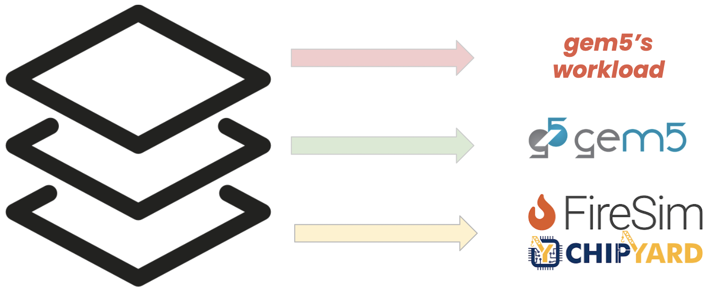

.. this will make a link in the index.html
Profiling an Architectural Simulator
==================

Overview
^^^^^^^^^^^^^^^^^^^^^^^^^^^^^^^^^^^^^^^^^^^^^^^^^^^^
gem5 is a state-of-the-art software-based architectural simulator with
wide spread use both in academia and industry. We set out to profile the performance of gem5
on different platforms and evaluate its performance. Our observation show that gem5 is
1.7x~3.02x faster on a MacBook Pro w/ M1 vs. Dell server w/ Intel Xeon Gold.
Hence, we use FireSim to validate our hypothesis that gem5 is largely impacted by its cache sizes. Insightful stats like cache misses, 
branch mispredictions, cpu utilization etc. are collected by reading performance counters on these platforms.
In this documentation, we describe the steps for running gem5 as a workload on FireSim.

.. calculating Velocity Feed Forward gain (kF)
.. ~~~~~~~~~~~~~~~~~~~~~~~~~~~~~~~~~~~~~~~~~~~
.. the "tilde" underline will greate a sub-sub section with a link 

.. .. this will make a smaller bold template
.. Do I need to calculate kF?
.. ----------------------------------------------------------------------------------
.. If using any of the control modes, we recommend calculating the kF:

.. .. this is how you can make a table
.. General Closed-Loop Configs
.. ----------------------------------------------------------------------------------
.. +----------------------------------------+------------------------------------------------------------------------+
.. |               Parameters                |                         Description                                    |
.. +----------------------------------------+------------------------------------------------------------------------+
.. | PID 0 Primary Feedback Sensor          |  | Selects the sensor source for PID0 closed loop, soft limits, and    |
.. |                                        |  | value reporting for the SelectedSensor API.                         |
.. +----------------------------------------+------------------------------------------------------------------------+
.. | PID 0 Primary Sensor Coefficient       |  | Scalar (0,1] to multiply selected sensor value before using.        |
.. |                                        |  | Note this will reduce resolution of the closed-loop.                |
.. +----------------------------------------+------------------------------------------------------------------------+
.. | PID 1 Aux Feedback Sensor              |  Select the sensor to use for Aux PID[1].                              |
.. +----------------------------------------+------------------------------------------------------------------------+
.. | PID 1 Aux Sensor Coefficient           |  | Scalar (0,1] to multiply selected sensor value before using.        |
.. |                                        |  | Note that this will reduce the resolution of the closed-loop.       |
.. +----------------------------------------+------------------------------------------------------------------------+
.. | PID 1 Polarity                         |  | False: motor output = PID[0] + PID[1],  follower = PID[0] - PID[1]. |
.. |                                        |  | True : motor output = PID[0] - PID[1],  follower = PID[0] + PID[1]. |
.. |                                        |  | This only occurs if follower is an auxiliary type.                  |
.. +----------------------------------------+------------------------------------------------------------------------+
.. | Closed Loop Ramp                       |  | How much ramping to apply in seconds from neutral-to-full.          |
.. |                                        |  | A value of 0.100 means 100ms from neutral to full output.           |
.. |                                        |  | Set to 0 to disable.                                                |
.. |                                        |  | Max value is 10 seconds.                                            |
.. +----------------------------------------+------------------------------------------------------------------------+

.. Configurations
.. ^^^^^^^^^^^^^^^^^^^^^^^^^^^^^^^^^^^^^^^^^^^^^^^^^^^^
.. Add some text ....
.. We change the CPU type, number of CPUs, and memory size. We use the following CPU types:

.. AtomicSimpleCPU (Atomic)
.. ----------------------------------------------------------------------------------
.. CPU type with CPI = 1 where memory accesses are atomic and completed without modeling any contention or queuing delays.

.. TimingSimpleCPU (Timing)
.. ~~~~~~~~~~~~~~~~~~~~~~~~~~~~~~~~~~~~~~~~~~~
.. CPU type with CPI = 1 where memory accesses are modeled in detail considering the queuing delays and resource contentions in the memory and interconnect.

.. In-order CPU (Minor)
.. ~~~~~~~~~~~~~~~~~~~~~~~~~~~~~~~~~~~~~~~~~~~
.. In-order or Minor CPU models a fixed pipeline with strict in-order instruction execution. Minor CPU uses the detailed timing memory mode  for accessing memory.

.. Out-of-order CPU (O3)
.. ~~~~~~~~~~~~~~~~~~~~~~~~~~~~~~~~~~~~~~~~~~~
.. O3 CPU models an out-of-order superscalar loosely based on the Alpha 2126 core. O3 CPU uses the detailed timing memory model for accessing memory.

.. Some text refering to the table below ....

.. .. heres how to put in a table with scrolling
.. Base Hardware Configuration on FireSim
.. ----------------------------------------------------------------------------------
.. =======================================     =========================================================================================================================================================================================================================================================================================================================  
.. Parameters										Value							
.. =======================================     =========================================================================================================================================================================================================================================================================================================================  
.. Core Frequency                                  4GHz
.. Number of Cores                                 4 Cores
.. Superscalar                                     8-width wide
.. ROB/IQ/LQ/SQ Entries                            192/64/32/32
.. Int & FP Registers                              128 & 192
.. Branch Predictor/BTB Entries                    TournamentBP/4096
.. Cache: L1I/L1D                                  48KB(I), 32KB(D)
.. DRAM                                            2GB, DDR3-1600-8x8
.. Operating System                                Linux Linaro (kernel 5.4.0)
.. =======================================     ========================================================================================================================================================================================================================================================================================================================= 

.. We set out to find the answers to the following questions 
.. ~~~~~~~~~~~~~~~~~~~~~~~~~~~~~~~~~~~~~~~~~~~
.. • Where are the bottlenecks in a state-of-theart architectural simulator?
.. •  How much faster can architectural simulations run by tuning system configurations?
.. • What are the opportunities in accelerating software simulation using hardware accelerators?

Details
^^^^^^^^^^^^^^^^^^^^^^^^^^^^^^^^^^^^^^^^^^^^^^^^^^^^

Running gem5 on FireSim
~~~~~~~~~~~~~~~~~~~~~~~~~~~~~~~~~~~~~~~~~~~

.. * **Neel Patel** - Masters Student, Department of Electrical Engineering and Computer Science, University of Kansas
The main idea is to execute gem5 as a workload on FireSim to validate our hypothesis that gem5 is largely imparted by the size of the l1 cache. 
To do this, the user must prepare the gem5 workload (Sieve of Eratosthenes), 
the FireSim workload, which in this case is the gem5 simulator, and finally, launch the FireSim simulation. Below 
we give the general steps required to achieve this:

Steps to run gem5 on FireSim
~~~~~~~~~~~~~~~~~~~~~~~~~~~~~~~~~~~~~~~~~~~

1. Set up the AWS FireSim environment

2. Build the gem5 binary for RISC-V ISA

3. Prepare gem5 workload and transfer it to the instance

4. Create FireSim workload using FireMarshal

5. Build the target design and modify its parameter

.. 6. Modify parameters, tests, and results

Set up the AWS FireSim environment
~~~~~~~~~~~~~~~~~~~~~~~~~~~~~~~~~~~~~~~~~~~
We use a Z1d.2xlarge FireSim manager instance. Check out the FireSim documentation for more details.
https://docs.fires.im/en/stable/Initial-Setup/index.html

.. code-block:: bash

    mosh --ssh"=ssh -i firesim.pem" username@ip_addr #username is centos, ip_addr is dynamically assigned to the manager instance upon initialization

Build the gem5 binary for RISC-V ISA
~~~~~~~~~~~~~~~~~~~~~~~~~~~~~~~~~~~~~~~~~~~

• Use QEMU to emulate a RISC-V architecture for building the gem5 binary and installing dependencies.
• Test the compiled binary binary on We use a SiFive HiFive Unleashed developmental board, which natively runs Ubuntu.

Prepare gem5 workload and transfer it to the instance
~~~~~~~~~~~~~~~~~~~~~~~~~~~~~~~~~~~~~~~~~~~
• In this step, you should compile your binary (we used Sieve of Erastosthenes) for the gem5 target ISA.
• Next, transfer your compiled binary to the AWS EC2 F1 instance. We used sftp like this:

.. code-block:: bash

    sudo sftp -i firesim.pem "username@ip_addr"

.. code-block:: bash

    put <filename> #this apples to any file

Create FireSim workload using FireMarshal
~~~~~~~~~~~~~~~~~~~~~~~~~~~~~~~~~~~~~~~~~~~
• FireSim requires a .json input file format to define workloads (e.g. gem5) that will run on the target design. FireMarshal is used to manage this process. Check out the FireMarshal documentation for more details. https://firemarshal.readthedocs.io/en/latest/index.html.
• This produces the following .json file in the /home/centos/firesim/deploy/workload directory, which defines the gem5 workload, as well as its output

.. code-block:: bash 

    "benchmark_name": "gem5-workload",
    "common_simulation_outputs": [ "uartlog"],
    "workloads": 
    [ 
        {
    "name": "gem5-workload-gem5",
    "bootbinary": "../../../target-design/chipyard/software/firemarshal/images/gem5-workload-gem5-bin",
    "rootfs": "../../../target-design/chipyard/software/firemarshal/images/gem5-workload-gem5.img",
    "outputs": [ "/root/sim-environment/m5out" ] 
        } 
    ]

Build our target design and Modify parameters
~~~~~~~~~~~~~~~~~~~~~~~~~~~~~~~~~~~~~~~~~~~
To build your target design on FireSim, you can utilize any of the Chipyard's included RTL generators (e.g. Rocket Chip).

• We use a quad-core Rocket Chip with an 16KB 2-way set associative icache & dcache, and a 512KB l2 cache base config.
• To change the base system configuration, we had to specify new design parameters in TargetConfigs.scala file in the following path.​

.. code-block:: bash

    /home/centos/firesim/target-design/chipyard/generators/firechip/src/main/scala/TargetConfigs.Scala

An example of creating a target design with 64KB L1I and L1D Caches
~~~~~~~~~~~~~~~~~~~~~~~~~~~~~~~~~~~~~~~~~~~
We specify a quad-core rocket chip with a 64KB L1 icache and dcache in the TargetConfigs.scala file. Precedence of the parameters defined before goess from bottom up. Note that: The default block size is 64Bytes.

.. code-block:: bash

    class FireSimGem5ConfigQuadRocketConfig extends Config(
    new freechips.rocketchip.subsystem.WithL1ICacheWays(16) ++  // change rocket I$
    new freechips.rocketchip.subsystem.WithL1ICacheSets(64) ++	// change rocket I$
    new freechips.rocketchip.subsystem.WithL1DCacheWays(16) ++  // change rocket D$
    new freechips.rocketchip.subsystem.WithL1DCacheSets(64) ++	// change rocket D$
    new WithDefaultFireSimBridges ++
    new WithDefaultMemModel ++
    new WithFireSimConfigTweaks ++
    new chipyard.QuadRocketConfig)

• Modify config_build_recipe.yaml, config_build.yaml, & config_runtime.yaml files by adding the following lines.

**config_build_receipes.yaml**

.. code-block:: bash
    
    Modifying config_build_recipe.yaml
    firesim_rocket_quadcore_gem5_config: # This can be any name specified by the user
    DESIGN: FireSim
    TARGET_CONFIG: DDR3FRFCFSLLC4MB_WithDefaultFireSimBridges_WithFireSimTestChipConfigTweaks_FireSimGem5ConfigQuadRocketConfig
    PLATFORM_CONFIG: WithAutoILA_F140MHz_BaseF1Config
    deploy_triplet: null
    post_build_hook: null
    metasim_customruntimeconfig: null
    bit_builder_recipe: bit-builder-recipes/f1.yaml
    

**config_build.yaml**

.. code-block:: bash
    
    builds_to_run:
        - firesim_rocket_quadcore_gem5_config  # This name must match the name specified in config_build_recipes.yaml

**config_runtime.yaml**

.. code-block:: bash
    
    run_farm:
        # run farm hosts to spawn: a mapping from a spec below (which is an EC2
        # instance type) to the number of instances of the given type that you
        # want in your runfarm.
        run_farm_hosts_to_use:
        - f1.16xlarge: 0
        - f1.4xlarge: 0
        - f1.2xlarge: 1 # we want to use f1.2xlarge as the runfarm instance
        - m4.16xlarge: 0
        - z1d.3xlarge: 0
        - z1d.6xlarge: 0
        - z1d.12xlarge: 0

    target_config:
        topology: no_net_config
        no_net_num_nodes: 1
        link_latency: 6405
        switching_latency: 10
        net_bandwidth: 200
        profile_interval: -1

        # This references a section from config_hwdb.yaml for fpga-accelerated simulation
        # or from config_build_recipes.yaml for metasimulation
        # In homogeneous configurations, use this to set the hardware config deployed
        # for all simulators
        default_hw_config: firesim_rocket_quadcore_gem5_config

    workload:
        workload_name: gem5-workload.json

• Next, we use golden gate compiler to generate the verilog code from the Chisel-generated RTL code for the AWS AGFI build process.

**To move to the golden gate compiler directory, run:**

.. code-block:: bash
    
    cd /home/centos/firesim/sim/

**Run make**

.. code-block:: bash

    make DESIGN=FireSim TARGET_CONFIG=DDR3FRFCFSLLC4MB_WithDefaultFireSimBridges_WithFireSimTestChipConfigTweaks _FireSimGem5ConfigQuadRocketConfig PLATFORM_CONFIG=WithAutoILA_F140MHz_BaseF1Config f1

**Build the AWS FPGA Image by executing:**

.. code-block:: bash

    firesim buildbitstream

• After a successfull build, update config_hwdb.yaml with the AGFI info.

.. code-block:: bash

    firesim_rocket_quadcore_gem5_config: # Add your AGFI info to config_hwdb.yaml, so they can be deployed during simulation
	agfi: agfi-06e876ba9378cc9ff
	deploy_triplet_override: null
	custom_runtime_config: null

• Then, launch runfarm instance, setup the simulation infrastructure, and run your firesim simulation. 

.. code-block:: bash

    firesim launchrunfarm; firesim infrasetup; firesim runworkload

• Finally, results can be collected from the following directory.

.. code-block:: bash

     cd /home/centos/firesim/results-workload/​​

Publications
^^^^^^^^^^^^^^^^^^^
Johnson Umeike, Neel Patel, Alex Manley, Amin Mamandipoor, Heechul Yun, Mohammad Alian, "Profiling gem5 Simulator," ISPASS 2023 [paper_] [slides_]

.. _paper: https://kansas-my.sharepoint.com/personal/m258a886_home_ku_edu/Documents/Alian%20Research%20Group/docs/papers/2023/ispass-gem5_profiling/ISPASS_2023_Profiling_gem5_Simulator_Final_Paper.pdf?CT=1680301153189&OR=ItemsView

.. _slides: http://arg.ku.edu/build/html/ProfilingGem5.html#publications

Personnel
^^^^^^^^^^^^^

• Johnson Umeike (Lead Author Student)
• Neel Patel (Co-Author Student)
• Alex Manley (Co-Author Student)
• Amin Mamandipoor (Co-Author Student)
• Heechul Yun (KU Collaborator)
• Mohammad Alian (Principal Investigator)

.. _Johnson Umeike: https://UmeikeJohnson.github.io/

.. _Neel Patel: https://people.eecs.ku.edu/~n869p538/

.. _Alex Manley: https://amanley97.github.io/

.. _Amin Mamandipoor: https://amin-mamandi.github.io/

.. _Heechul Yun: https://www.ittc.ku.edu/~heechul/

.. _Mohammad Alian: https://alian-eecs.ku.edu/