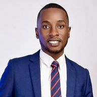
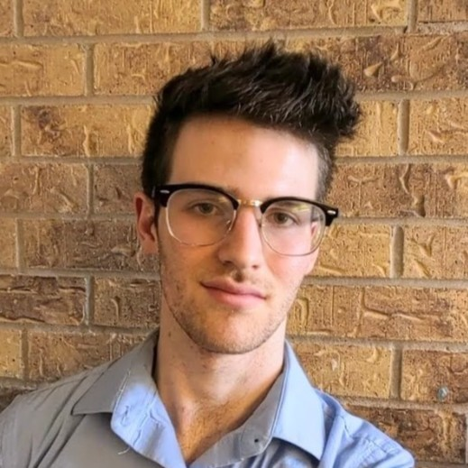

Staff Members
==================

Lab Director
~~~~~~~~~~~~~~~~~~~
.. image:: img/malian.png
    :width: 200px
    :align: left
    :alt: Mohammad Alian
* **Mohammad Alian** - Assistant Professor, Department of Electrical Engineering and Computer Science, University of Kansas
    Mohammad Alian is an Assistant Professor at the EECS department of the University of Kansas. Before joining KU, he completed his Ph.D. and MS at UIUC and UW-Madison, respectively. At UIUC, he developed dist-gem5 and MCN. dist-gem5 is part of the official gem5 release and MCN is the precursor to the development of Samsung's AxDIMM. His team at KU got second place Samsung open innovation contest for AxDIMM technology. Four best paper candidacies have recognized his research in top computer architecture conferences, including MICRO 2018 and HPCA 2017, and an honorable mention in IEEE Micro Top Picks 2017. He is a co-PIs of the SRC/DARPA JUMP 2.0 ACE Center for Evolvable Computing aiming at transforming the distributed computing of the next decade. Mohammad's research explores opportunities in the intersection of computer architecture and networking to shape the future of data centeric computing.

Graduate Students
~~~~~~~~~~~~~~~~~~~
.. image:: img/amin.jpg
    :width: 200px
    :align: left
    :alt: Amin Mamandi

* **Amin Mamandi** - PhD Student, Department of Electrical Engineering and Computer Science, University of Kansas
    |
    |
    |
    |
    |
    |
    |

* **Johnson Umeike** - PhD Student, Department of Electrical Engineering and Computer Science, University of Kansas
    Johnson is a 2nd year Ph.D. student in the Electrical Engineering and Computer Science department at the University of Kansas. I earned my B.Eng. degree from the Federal University of Technology, Owerri (FUTO) in Nigeria. My research interests are in computer architecture, operating systems, computer networking, high-performance computing, and emerging technologies. In my work with the Architecture Research Group, I have explored the optimization of software architectural simulators to enable efficient computer design and reduce energy costs. I am also working on "Device-less Networking" which investigates efficient CPU designs for improved I/O performance. I am advised by Dr. Mohammad Alian. Skill Set: C++, C, python, system modeling, and performance evaluation.

.. image:: img/neel.jpg
    :width: 200px
    :align: left
    :alt: Neel Patel

* **Neel Patel** - Masters Student, Department of Electrical Engineering and Computer Science, University of Kansas
   I am a graduate research assistant at the Institute for Information Sciences at KU. My current research interests include distrubuted systems, warehouse-scale computing, and applications of data center technologies.
   I am currently pursuing my M.S. in Computer Science under the advisement of Professor Mohammad Alian.
   Currently, I am supported by KU's Undergraduate Research Fellows Program.

Undergraduate Students
~~~~~~~~~~~~~~~~~~~~~~~~~

* **Derrick Quinn** - Undergraduate Student, Department of Electrical Engineering and Computer Science, University of Kansas
    I will be completing my undergraduate studies at the University of Kansas in May 2023 with a B.S. in Mathematics and Computer Science, and I am excited to be starting my Ph.D. program in Computer Science at KU this fall. My primary research interests lie in the fields of Computer Architecture and Accelerated Computing/HPC, with current research projects in Accelerated HPC Networking, as well as in the Modeling of Accelerated Systems. My language and platform of choice is Rust on Linux or MacOS, though I am also proficient in other programming languages such as C, Python, and shell scripting.

* **Luke Staudacher** - Undergraduate Student, Department of Electrical Engineering and Computer Science, University of Kansas
Luke Staudacher is a dynamic Computer Engineering undergraduate with expertise in backend web development, robotics, and electrical system design. Currently pursuing his Bachelor's degree in Computer Engineering from the University of Kansas, Luke is a distinguished member of the SELF (Student Engineering Leadership Fellowship) program and Eta Kapa Nu. At I2S, Luke is contributing to the near memory networking project under the mentorship of Dr. Mohamad Alian, where his responsibilities include Verilog development, design tool investigation and web development. Luke is skilled in C/C++, Java, Python, Verilog, VHDL, as well as both Linux and Windows operating systems. He has also worked with industry-standard CAD software such as Cadence Design Suite, KiCAD, and Solidworks. With a strong academic foundation and diverse technical skills, Luke is excited to pursue a career in computer architecture and make significant contributions to the world of technology.