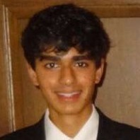

Staff Members
==================

Lab Director
~~~~~~~~~~~~~~~~~~~
.. image:: img/malian.png
    :width: 200px
    :align: left
    :alt: Mohammad Alian
* **Mohammad Alian** - Assistant Professor, Department of Electrical Engineering and Computer Science, University of Kansas
    Mohammad Alian is an Assistant Professor at the EECS department of the University of Kansas. Before joining KU, he completed his Ph.D. and MS at UIUC and UW-Madison, respectively. At UIUC, he developed dist-gem5 and MCN. dist-gem5 is part of the official gem5 release and MCN is the precursor to the development of Samsung's AxDIMM. His team at KU got second place Samsung open innovation contest for AxDIMM technology. Four best paper candidacies have recognized his research in top computer architecture conferences, including MICRO 2018 and HPCA 2017, and an honorable mention in IEEE Micro Top Picks 2017. He is a co-PIs of the SRC/DARPA JUMP 2.0 ACE Center for Evolvable Computing aiming at transforming the distributed computing of the next decade. Mohammad's research explores opportunities in the intersection of computer architecture and networking to shape the future of data centeric computing.

Graduate Students
~~~~~~~~~~~~~~~~~~~

* **Amin Mamandipoor** - PhD Student, Department of Electrical Engineering and Computer Science, University of Kansas
    Amin is currently pursuing his second-year Ph.D. in the EECS department at KU. He completed his B.Sc. and M.Sc. degrees in Computer Engineering from the University of Tabriz in 2018 and 2022, respectively. His research interests span across computer systems design, with a primary focus on computer architecture, datacenter networking, and operating systems. Currently, he is involved in a project that focuses on developing near-memory processing accelerators. He is skilled in several programming languages and software tools, including C/C++, Java, Python, Verilog, VHDL, as well as design software such as Cadence Virtuoso and Xilinx Vivado. Here is Amin's personal 'website'_ 
    .. _website: https://amin-mamandi.github.io/

.. image:: img/johnson.png
    :width: 200px
    :align: left
    :alt: Johnson Umeike

* **Johnson Umeike** - PhD Student, Department of Electrical Engineering and Computer Science, University of Kansas
    Johnson is a 2nd year Ph.D. student in the Electrical Engineering and Computer Science department at the University of Kansas. I earned my B.Eng. degree from the Federal University of Technology, Owerri (FUTO) in Nigeria. My research interests are in computer architecture, operating systems, computer networking, high-performance computing, and emerging technologies. In my work with the Architecture Research Group, I have explored the optimization of software architectural simulators to enable efficient computer design and reduce energy costs. I am also working on "Device-less Networking" which investigates efficient CPU designs for improved I/O performance. I am advised by Dr. Mohammad Alian. Skill Set: C++, C, python, system modeling, and performance evaluation.
    
.. image:: img/ramesh.png
    :width: 200px
    :align: left
    :alt: Ramesh Ganapam

* **Ramesh Ganapam** - PhD Student, Department of Electrical Engineering and Computer Science, University of Kansas
   Ramesh is a second year PhD student in the EECS department at the University of Kansas. I earned my BTech degree from the Jawaharlal Nehru Technological university Kakinada (affiliated) in ECE Department and ME degree from Birla Institute of Technology and Sciences, Pilani (BITS - Pilani) in EE department from India. My research interests are in Computer Architecture, VLSI Design, Operating Systems, and Computer Networking. Presently I am working on DRAM circuit chip modelling under the advisement of Dr. Mohammad Alian. Skill set: C++, C, Verilog, LT spice and Python.

* **Neel Patel** - Masters Student, Department of Electrical Engineering and Computer Science, University of Kansas
   I am a graduate research assistant at the Institute for Information Sciences at KU. My current research interests include distrubuted systems, warehouse-scale computing, and applications of data center technologies.
   I am currently pursuing my M.S. in Computer Science under the advisement of Professor Mohammad Alian.
   Currently, I am supported by KU's Undergraduate Research Fellows Program.

Undergraduate Students
~~~~~~~~~~~~~~~~~~~~~~~~~

    
* **Alex Manley** - Undergraduate Student, Department of Electrical Engineering and Computer Science, University of Kansas
Alex Manley is currently an Undergraduate Computer Engineering student who has worked with Dr. Mohammad Alian for almost 2.5 years. While he will be completing his Bachelors in May 2023, he intends to return to the University of Kansas in the Fall to complete a Masters in Computer Engineering. He is skilled in Programming Languages, such as C++, C, Python, Bash, and VHDL; has experience with software like Xilinx Vivado Suite, Gem5, QEMU, and Linux; and has worked with hardware platforms including x86, ARM, RISC-V, and FPGAs. Through the application of his skills and research experience, he is currently an active member of the gem5-acceleration, AxDIMM, and Block Memory Controller projects. He is interested in Computer Architecture and Hardware Design and you can view more information about him on his website: amanley97.github.io!

.. image:: img/Quinn.png
    :width: 200px
    :align: left
    :alt: Derrick Quinn

* **Derrick Quinn** - Undergraduate Student, Department of Electrical Engineering and Computer Science, University of Kansas
    I will be completing my undergraduate studies at the University of Kansas in May 2023 with a B.S. in Mathematics and Computer Science, and I am excited to be starting my Ph.D. program in Computer Science at KU this fall. My primary research interests lie in the fields of Computer Architecture and Accelerated Computing/HPC, with current research projects in Accelerated HPC Networking, as well as in the Modeling of Accelerated Systems. My language and platform of choice is Rust on Linux or MacOS, though I am also proficient in other programming languages such as C, Python, and shell scripting.

* **Luke Staudacher** - Undergraduate Student, Department of Electrical Engineering and Computer Science, University of Kansas
Luke Staudacher is a Computer Engineering undergraduate at the University of Kansas with experience in backend web development, robotics, and electrical system design. He is a member of the SELF program and Eta Kapa Nu and currently works on the near memory networking project at I2S under Dr. Mohamad Alian. Luke is proficient in C/C++, Java, Python, Verilog, VHDL, Linux, and Windows, and has worked with CAD software such as Cadence Design Suite, KiCAD, and Solidworks. He is passionate about pursuing a career in technology and making meaningful contributions to the field.
